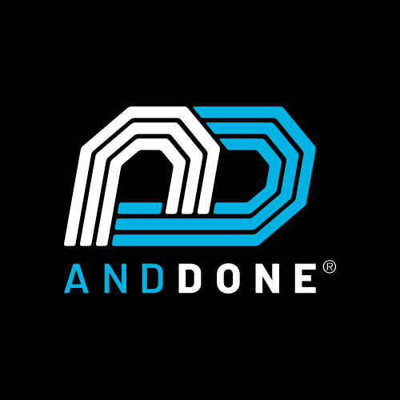
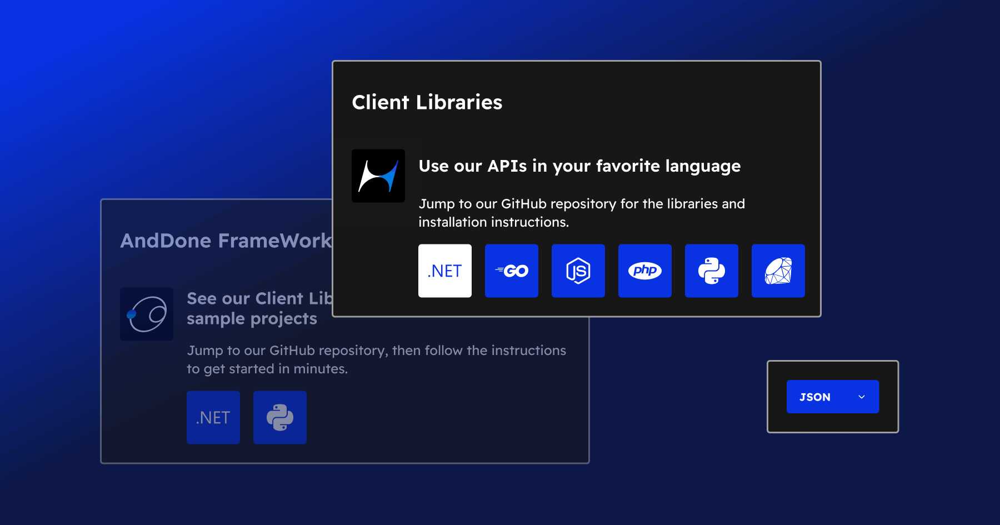
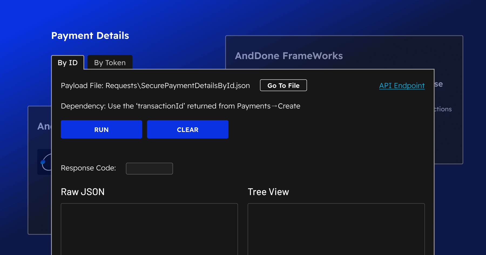
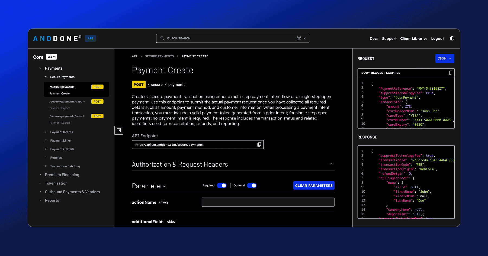
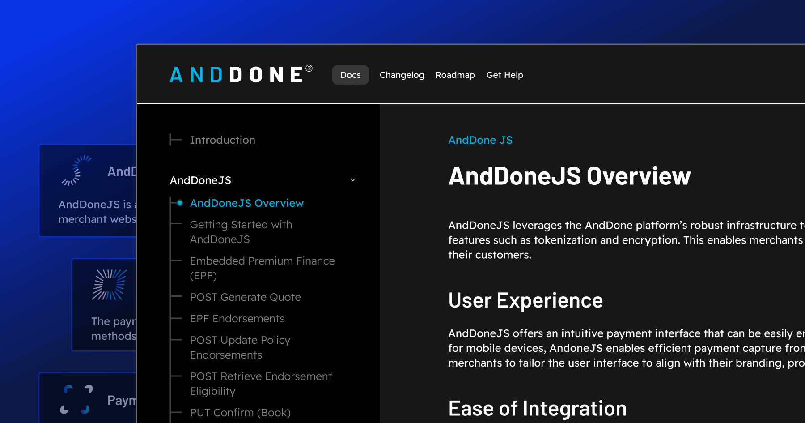

<!-- HERO -->

<h2>Payments for Insurance made simple</h2>

AndDone is purpose-built to simplify insurance payments.

<!-- BADGES -->

  
  
  

---

## 🧰 Overview

AndDone is built to simplify insurance payments.  
Our APIs, SDKs, and sample apps help you move faster, reduce manual work, and support both pay-in-full and premium finance options all from one platform.

We created this GitHub to help developers get started quickly, test with confidence, and integrate with clarity.

---

## 🔗 Quick Links

<table>
  <tr>
    <td width="50%"><b><a href="https://www.anddone.com" target="_blank">🌐 AndDone Website</a></b> Learn more about our payments platform</td>
    <td width="50%"><b><a href="#-client-libraries">📦 Client Libraries</a></b> Node.js, Python, .NET, Ruby, and more</td>
  </tr>
  <tr>
    <td width="50%"><b><a href="#-anddone-frameworks">🧪 AndDone Frameworks</a></b> Run live requests with ready-to-use frameworks</td>
    <td width="50%"><b><a href="https://explorer.anddone.com" target="_blank">🧭 API Explorer</a></b> View endpoints, build sample payloads, generate working code</td>
  </tr>
  <tr>
    <td width="50%"><b><a href="https://docs.anddone.com/" target="_blank">📘 Developer Docs</a></b> Clear, step-by-step guidance for building with AndDone’s API</td>
    <td width="50%"><b><a href="#-coming-soon">📬 Coming Soon</a></b> Recipes and new developer tools</td>
  </tr>
</table>

---

## 📦 Client Libraries

Use our prebuilt SDKs to get up and running quickly.

<table>
  <tr>
    <td><small>✅</small> Easy installation</td>
    <td><small>✅</small> Auth and config setup</td>
    <td><small>✅</small> Sample payloads</td>
  </tr>
  <tr>
    <td><small>✅</small> Live API support</td>
    <td><small>✅</small> Code you can copy, paste, and run</td>
    <td>&nbsp;</td>
  </tr>
</table>

 

<b>Available libraries:</b>

<table>
  <tr>
    <td>Node.js</td>
    <td>Python</td>
    <td>.NET</td>
  </tr>
  <tr>
    <td>Go</td>
    <td>Ruby</td>
    <td>PHP (coming soon)</td>
  </tr>
</table>

---

## 🧪 AndDone Frameworks

Try a working integration in minutes. Our sample apps include:

<table>
  <tr>
    <td><small>✅</small> Prebuilt UI</td>
    <td><small>✅</small> Config file for your credentials</td>
  </tr>
  <tr>
    <td><small>✅</small> Ready-to-run payloads</td>
    <td><small>✅</small> Live response testing</td>
  </tr>
</table>

 

<b>Current frameworks:</b>

<table>
  <tr>
    <td>Python</td>
    <td>.NET</td>
    <td>PHP (coming soon)</td>
  </tr>
</table>

---

## 🧭 API Explorer

The AndDone API Explorer helps you explore endpoints, build payloads, and generate code — all in one place.

<table>
  <tr>
    <td><small>✅</small> Search across all endpoints</td>
    <td><small>✅</small> Build sample payloads with valid JSON</td>
  </tr>
  <tr>
    <td><small>✅</small> View request and response samples</td>
    <td><small>✅</small> Toggle between Core and Ally endpoints (Ally coming soon)</td>
  </tr>
  <tr>
    <td colspan="2"><small>✅</small> Generate working code in 6 languages (Node.js, Python, PHP, .NET, Go, Ruby)</td>
  </tr>
</table>

 

<b>Version supported:</b> v2.3

---

## 📘 Developer Docs

The Developer Docs provide clear, practical guides for every step of the integration process.

Start fast with docs that walk you through:

<table>
  <tr>
    <td><small>✅</small> Authentication and headers</td>
    <td><small>✅</small> Payload structure and field-level details</td>
  </tr>
  <tr>
    <td><small>✅</small> Core vs. Ally endpoint differences</td>
    <td><small>✅</small> Error messages and troubleshooting tips</td>
  </tr>
  <tr>
    <td colspan="2"><small>✅</small> Real-world use case examples</td>
  </tr>
</table>

 

Built to support first-time builders and advanced dev teams alike.

---

## 📬 Coming Soon

### 🍳 Recipes

Step-by-step walkthroughs of real-world payment workflows.

<b>Each recipe will include:</b>

<table>
  <tr>
    <td><small>✅</small> Narrative breakdown of the flow</td>
    <td><small>✅</small> Links to required endpoints</td>
  </tr>
  <tr>
    <td><small>✅</small> Sample requests and responses</td>
    <td><small>✅</small> Helpful context and developer notes</td>
  </tr>
</table>

---

## 🤝 Connect with Us

---

## 🛠 Contributing

We welcome your feedback and suggestions.

<table>
  <tr>
    <td><small>✅</small> Contribution guidelines coming soon</td>
    <td><small>✅</small> Report issues directly in each repo</td>
  </tr>
  <tr>
    <td colspan="2"><small>✅</small> Suggest features or improvements via Discussions</td>
  </tr>
</table>

 

Built by the AndDone team  
Powered by IPFS

